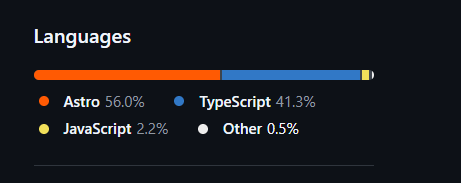

<h1 align="center">🍰 Snackify</h1>

<p align="center">
Bakery ERP & CRM System  
<br/>
Sistema ERP y CRM para gestión de dulces y repostería
</p>

<p align="center">


</p>

---

> 📌 Full-stack ERP/CRM system for bakery business management

---

## 🚀 Overview | Descripción

**EN 🇺🇸**  
Snackify is a web-based ERP & CRM system designed to manage a bakery business, including products, orders, users, and roles.

It simulates real-world workflows such as inventory management, order processing, and role-based access control.

**ES 🇲🇽**  
Snackify es un sistema ERP y CRM web diseñado para gestionar un negocio de repostería, incluyendo productos, pedidos, usuarios y roles.

Simula flujos reales como inventario, procesamiento de pedidos y control de accesos.

---

## ✨ Features | Funcionalidades

**EN 🇺🇸**
- 🍰 Product management (cakes, desserts, snacks)  
- 🛒 Order management system  
- 👥 Role-based access (admin, employee, user)  
- 📊 Business workflow simulation  
- 🗄️ MySQL database integration  

**ES 🇲🇽**
- 🍰 Gestión de productos (pasteles, dulces, snacks)  
- 🛒 Sistema de pedidos  
- 👥 Control de roles (admin, empleado, usuario)  
- 📊 Simulación de flujos de negocio  
- 🗄️ Integración con MySQL  

---


## 📊 Languages (GitHub Insights - Real)

<p align="center">
  
</p>

## 🧰 Tech Stack

| Category        | Stack |
|----------------|------|
| Frontend       | Astro, JavaScript / TypeScript, HTML, CSS |
| Backend Logic  | Node.js |
| Database       | MySQL |
| Architecture   | MVC + Role-Based Access Control (RBAC) |
| System Type    | ERP + CRM (Bakery Management System) |
| Tools          | Git, VS Code |

---

## 🧠 System Design | Diseño

**EN 🇺🇸**  
Snackify combines **ERP and CRM concepts** into a single system:

- ERP → product, inventory, and order management  
- CRM → user interaction and role handling  

**ES 🇲🇽**  
Snackify combina **ERP y CRM en un solo sistema**:

- ERP → productos, inventario y pedidos  
- CRM → gestión de usuarios y roles  

---

## 👤 Roles

- **Admin** → full system control  
- **Employee** → manage orders and products  
- **User** → browse and interact  

---

## 📂 Project Structure

```
/src
  /pages
  /components
  /layouts
  /services
/database
```

---

## 🚀 Getting Started

```bash
git clone https://github.com/Alucarduwu/Snackify.git
cd Snackify
npm install
npm run dev
```

---

## 💡 What I Learned | Aprendizajes

**EN 🇺🇸**
- Building ERP/CRM systems  
- Role-based authentication  
- Full-stack integration  
- Astro-based frontend architecture  
- Database design with MySQL  

**ES 🇲🇽**
- Desarrollo de sistemas ERP/CRM  
- Control de accesos por roles  
- Integración full stack  
- Uso de Astro como frontend  
- Diseño de bases de datos  

---

## 📈 Future Improvements | Mejoras Futuras

- 📊 Analytics dashboard  
- 📱 Mobile app (Flutter)  
- ☁️ Cloud deployment  
- 🧾 Billing system  
- 🔔 Notifications  

---

## 👩‍💻 Author

**Anahí Lozano**

- 💼 LinkedIn: https://www.linkedin.com/in/anahi-lozano-de-lira-a4213a187/  
- 🌐 Portfolio: https://portafolioanahi.vercel.app/  
- 📧 Email: anahydlira@gmail.com  

---

<p align="center">
Built with 💜 to simulate real business systems  
<br/>
Desarrollado con 💜 para simular sistemas reales de negocio
</p>
